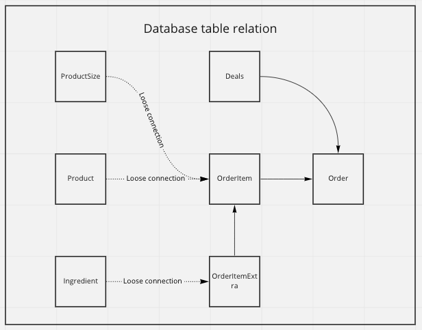

## DEVELOPMENT

Project uses
Ruby version: 3.1.0
Rails: 7.0.3
VSCode Extensions: Ruby, Ruby solargraph, Rubocop

## DATABASE

## RUN LOCALLY

Prerequisite: Docker

To run the project `docker compose up`
- If something goes wrong try to run `docker compose build` and try to run `up` again

To run rails command `docker compose run web rails [command]`.

Ex: `docker compose run web rails c` to open console or `docker compose run web rails routes` to print routes etc..

To run tests run `docker compose run web rails spec`

## DEPLOY

